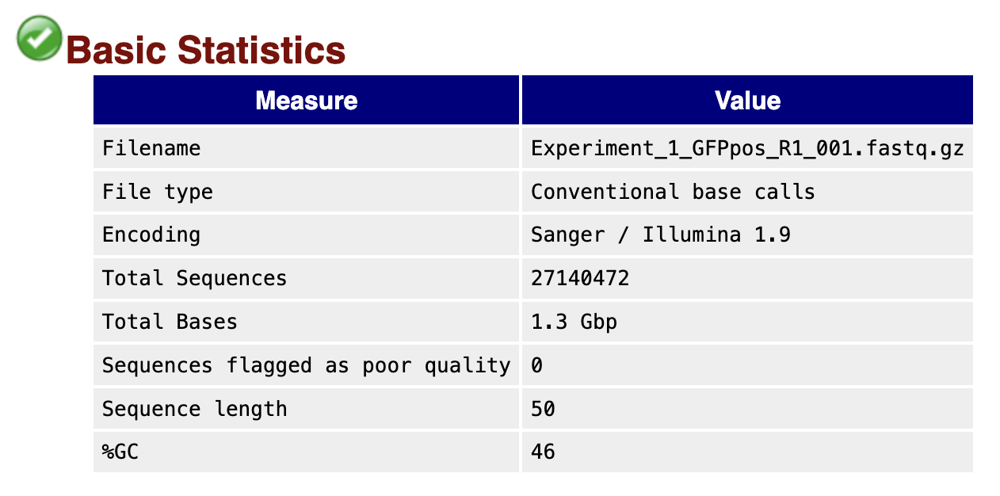
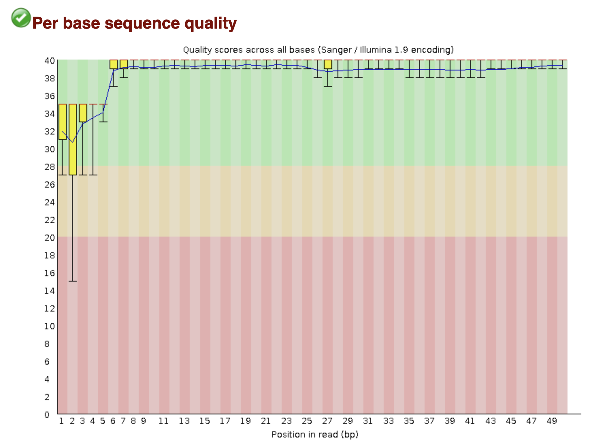
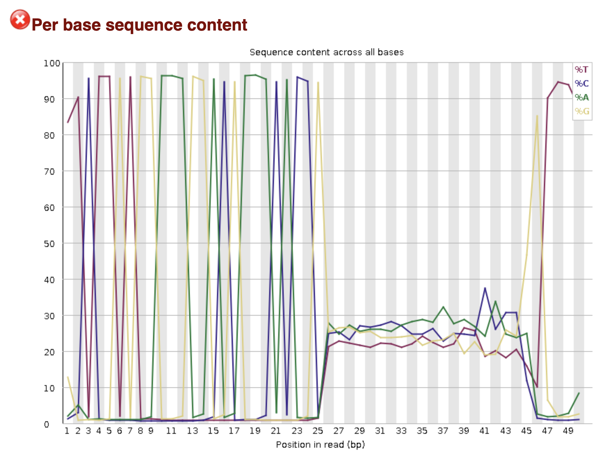

# QIBS Class Module 3 - Workshop #3: CRISPR Screen Data Analysis
Denis Torre and Tingfeng Guo, 2025

### 1. Introduction
---
The goal of this workshop is to outline the full computational workflow used in bulk CRISPR screening analysis data, including quality control, trimming, guide-sequence table generation, read counting with MAGeCK, and downstream R-based analysis and plotting.

For today's workshop, we will be analyzing publicly available CRISPR screen data from a published study aiming to identify regulators of human definitive endoderm (DE) differentiation: [Genome-scale screens identify JNK–JUN signaling as a barrier for pluripotency exit and endoderm differentiation](https://www.nature.com/articles/s41588-019-0408-9).

We will begin with basic quality control of the raw FASTQ files, followed by adapter removal and trimming to the expected gRNA length. Next, we will generate a clean gRNA reference table, quantify gRNA abundances with MAGeCK, and perform differential analysis to identify enriched or depleted guides. We will conclude with a brief R-based inspection of the gene-level results and simple visualizations.

### 2. Check data and environment access
---
First, connect to Cayuga via SSH using Visual Studio Code as described in previous workshops.

Next, make sure you can load the conda environment that contains all the necessary tools for this workshop:

```bash
conda activate /athena/cayuga_0083/scratch/det4016/envs/crispr_env
```

Confirm access to the directory where the workshop data is stored:

```bash
cd /athena/cayuga_0083/scratch/det4016/qibs-crispr-workshop
ls
```

You should see the following files and directories:

```
crispr_data/
README.md
```

The FASTQ files for this workshop are located in the `crispr_data/01-fastq` directory:

```bash
ls /athena/cayuga_0083/scratch/det4016/qibs-crispr-workshop/crispr_data/01-fastq
```
You should see the following files: 

```
Experiment_1_GFPneg_R1_001.fastq.gz
Experiment_1_GFPpos_R1_001.fastq.gz
Experiment_2_GFPneg_R1_001.fastq.gz
Experiment_2_GFPpos_R1_001.fastq.gz
Experiment_3_GFPneg_R1_001.fastq.gz
Experiment_3_GFPpos_R1_001.fastq.gz
```

These files correspond to sequencing reads from GFP-positive and GFP-negative sorted cell populations, respectively. 
The cells used in this study contain a knock-in GFP reporter at the SOX17 locus, which is a key marker of endoderm fate. Therefore, the GFP-positive cells are expected to be enriched for guides promoting endoderm differentiation, while GFP-negative cells should be depleted of such guides.

The data was collected across three separate experiments, with slightly different variations in the differentiation protocol used each time:
- Experiment 1: Kieffer differentiation protocol, Day 2
- Experiment 2: Kieffer differentiation protocol, Day 3
- Experiment 3: Kroon differentiation protocol, Day 3

To start, we will perform quality control and trimming on a single FASTQ file (Experiment_1_GFPpos_R1_001.fastq.gz) to demonstrate the workflow.

Next, we will analyze the processed count files for all experiments located in the `/home/fs01/det4016/qibs-crispr-workshop/det4016/qibs-crispr-workshop/crispr_data/02-mageck_count` directory.

### 3. Setup working directory
---
Create a working directory for this workshop and navigate into it:
```bash
# Create directory name variable:
workdir=/athena/qibs_class/scratch/$(whoami)/workshopCRISPR

# Display it
echo $workdir

# Create the directory
mkdir -p $workdir

# Navigate into it
cd $workdir
```

Next, open the working directory in VS Code, using File > Open Folder and navigating to the directory you just created.

### 4. Run FASTQC
---
First, we will perform quality control on the raw FASTQ files using FastQC.

```bash

# Make sure you are in the working directory and the conda environment is activated
cd $workdir
conda activate /athena/cayuga_0083/scratch/det4016/envs/crispr_env

# Create output directory for FastQC reports
mkdir 01-fastqc

# Run FastQC on the raw FASTQ file
fastqc /athena/cayuga_0083/scratch/det4016/qibs-crispr-workshop/crispr_data/01-fastq/Experiment_1_GFPpos_R1_001.fastq.gz -o 01-fastqc

```

This command should take approximately 1 minute. The `fastqc` program will generate an HTML report that you can open in your web browser to assess the quality of the sequencing data. To view the report, use the `Live Preview` plugin in VS Code or transfer the HTML file to your local machine by right clicking on the html file and selecting "Download".

Now, we can inspect the FastQC report:




By inspecting the per base sequence content plot, we can observe how the nucleotide distribution varies across the length of the reads. In CRISPR screen data, we often see a non-random distribution of nucleotides at the start of the reads due to the presence of sequencing adapters:


Here, we can observe strong biases in the first 25 bases, which correspond to the sequencing adapters. The following 20 bases show a more balanced nucleotide distribution, which is expected for the gRNA sequences. Lastly, the final bases again show biases due to the presence of trailing adapter sequences. These adapters need to be removed before proceeding with downstream analysis.

We can inspect the first few reads in the FASTQ file to confirm the presence of adapter sequences:

```bash
# View the first 8 lines of the FASTQ file
zcat /athena/cayuga_0083/scratch/det4016/qibs-crispr-workshop/crispr_data/01-fastq/Experiment_1_GFPpos_R1_001.fastq.gz | head -n 12
```
You should see output similar to the following:
```
@GWNJ-0478:462:GW1805021130:1:1102:1525:1989 1:N:0:CGAGTAAT
TTCTTGTGGAAGGACGAAACACCGATCCGGCAGGCAAAGTACCAGTTTTA
+
DDDDDIIIIIIIIIIIIIIIIIIIIIIIIIIIIIIIIIIIIIIIIIIIII
@GWNJ-0478:462:GW1805021130:1:1102:2393:1982 1:N:0:CGAGTAAT
NTCTTGTGGAAAGGACGAAACACCGAGTTGTACGTGAGCGTCCAGGTTTT
+
#<<DDHIIIIIIHIHHIIIIIIIIIHHHHGHHIIIIIIIIIIIIIIIIII
@GWNJ-0478:462:GW1805021130:1:1102:3182:1995 1:N:0:CGAGTAAT
TTCTTGTGGAAAGGACGAAACACCGTCAGCCAGAAGCTCTACAGAGTTTT
+
<DDDDIIIIGIIHHHIIIIIIIIIIIIIIIIIIIIIIIIIIIIIHIIIIH
```

Notice the structure of the reads: <span style="background-color: #ffffb3">TTCTTGTGGAAGGACGAAACACCG</span>ATCCGGCAGGCAAAGTACCA<span style="background-color: #8dd3c7">GTTTTA</span>


### 5. Trim adapters with Cutadapt
---

To remove the adapter sequences from the reads, we will use the `cutadapt` tool. First, we need to identify the adapter sequences used in the library preparation. For this dataset, we can use the following 5' adapter sequence: `TGTGGAAAGGACGAAACACCG`. 


Then, we can run `cutadapt` to trim the adapters from the reads, and retain the 20 base gRNA sequences.

```bash
# Create output directory for trimmed FASTQ files
mkdir 02-trimmed_fastq

# Run cutadapt to trim adapters and retain 20 base gRNA sequences
cutadapt \
    -g TGTGGAAAGGACGAAACACCG \
    --length 20 \
    --discard-untrimmed \
    -j 8 \
    -o 02-trimmed_fastq/Experiment_1_GFPpos_R1_001_trimmed.fastq.gz \
    /athena/cayuga_0083/scratch/det4016/qibs-crispr-workshop/crispr_data/01-fastq/Experiment_1_GFPpos_R1_001.fastq.gz  > 02-trimmed_fastq/Experiment_1_GFPpos_cutadapt_report.txt
```

This command should take approximately 2 minutes. The `cutadapt` program will generate a trimmed FASTQ file containing only the gRNA sequences.