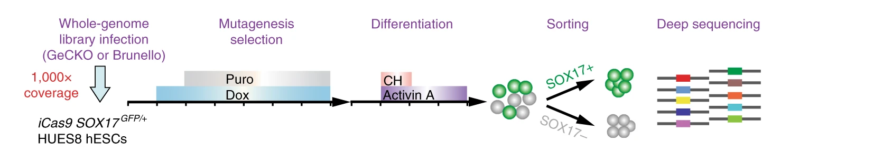
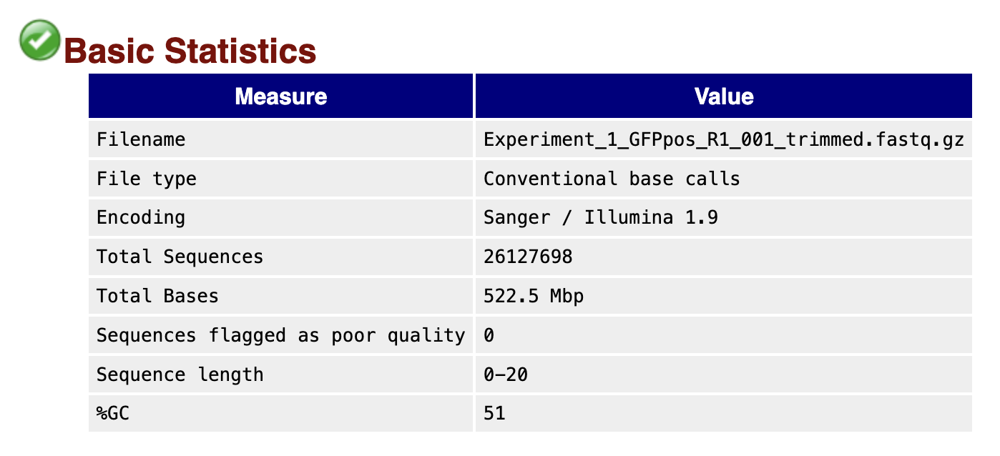
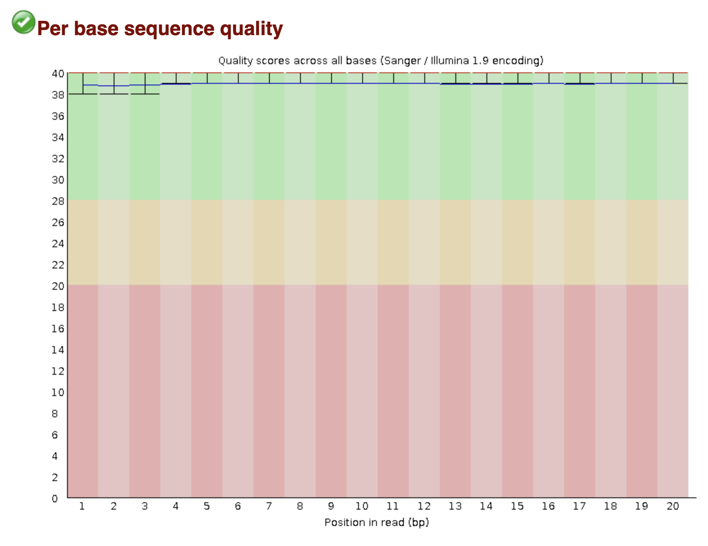
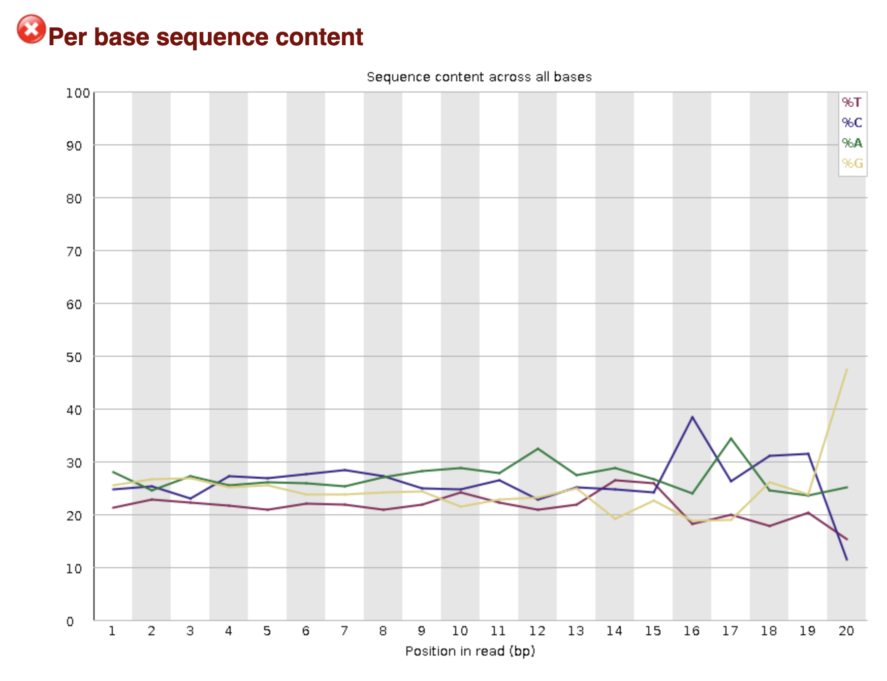
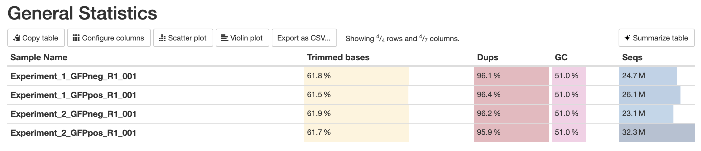

# QIBS Class Module 3 - Workshop #3: CRISPR Screen Data Analysis
Denis Torre and Tingfeng Guo, 2025

### 1. Introduction
---
The goal of this workshop is to outline the full computational workflow used in bulk CRISPR screening analysis data, including quality control, trimming, guide-sequence table generation, read counting with MAGeCK, and downstream R-based analysis and plotting.

For today's workshop, we will be analyzing publicly available CRISPR screen data from a published study aiming to identify regulators of human definitive endoderm (DE) differentiation: [Genome-scale screens identify JNK–JUN signaling as a barrier for pluripotency exit and endoderm differentiation](https://www.nature.com/articles/s41588-019-0408-9).

We will begin with basic quality control of the raw FASTQ files, followed by adapter removal and trimming to the expected gRNA length. Next, we will generate a clean gRNA reference table, quantify gRNA abundances with MAGeCK, and perform differential analysis to identify enriched or depleted guides. We will conclude with a brief R-based inspection of the gene-level results and simple visualizations.

### 2. Check data and environment access
---
First, connect to Cayuga via SSH using Visual Studio Code as described in previous workshops. Make sure you have full access to the workshop materials:

```bash
# Load the conda environment
conda activate /athena/cayuga_0083/scratch/det4016/envs/crispr_env

# Navigate to the workshop directory
cd /athena/cayuga_0083/scratch/det4016/qibs-crispr-workshop

# List the directory contents
ls
```

The FASTQ files for this workshop are located in the `crispr_data/01-fastq` directory:

```bash
ls /athena/cayuga_0083/scratch/det4016/qibs-crispr-workshop/crispr_data/01-fastq
```
You should see the following files: 

```
Experiment_1_GFPneg_R1_001.fastq.gz
Experiment_1_GFPpos_R1_001.fastq.gz
Experiment_2_GFPneg_R1_001.fastq.gz
Experiment_2_GFPpos_R1_001.fastq.gz
```

These files correspond to sequencing reads from GFP-positive and GFP-negative sorted cell populations, respectively. 
The cells used in this study contain a knock-in GFP reporter at the SOX17 locus, which is a key marker of endoderm fate. Therefore, the GFP-positive cells are expected to be enriched for guides promoting endoderm differentiation, while GFP-negative cells should be depleted of such guides.



To start, we will perform quality control and trimming on a single FASTQ file (`Experiment_1_GFPpos_R1_001.fastq.gz`) to demonstrate the workflow.

Next, we will analyze the processed count files for all experiments located in the `/athena/cayuga_0083/scratch/det4016/qibs-crispr-workshop/crispr_data/02-mageck_count` directory.

### 3. Setup working directory
---
Create a working directory for this workshop and navigate to it:
```bash
# Create directory name variable:
workdir=/athena/qibs_class/scratch/$(whoami)/workshopCRISPR

# Display it
echo $workdir

# Create the directory
mkdir -p $workdir

# Navigate into it
cd $workdir
```

Next, open the working directory in VS Code, using File > Open Folder and navigating to the directory you just created.

### 4. Run FASTQC
---
First, we will perform quality control on the raw FASTQ files using FastQC.

```bash

# Make sure you are in the working directory and the conda environment is activated
cd $workdir
conda activate /athena/cayuga_0083/scratch/det4016/envs/crispr_env

# Create output directory for FastQC reports
mkdir 01-fastqc

# Run FastQC on the raw FASTQ file
fastqc /athena/cayuga_0083/scratch/det4016/qibs-crispr-workshop/crispr_data/01-fastq/Experiment_1_GFPpos_R1_001.fastq.gz -o 01-fastqc

```

This command should take approximately 1 minute. The `fastqc` program will generate an HTML report that you can open in your web browser to assess the quality of the sequencing data. To view the report, use the `Live Preview` plugin in VS Code or transfer the HTML file to your local machine by right clicking on the html file and selecting "Download".

Now, we can inspect the FastQC report:


By inspecting the per base sequence content plot, we can observe how the nucleotide distribution varies across the length of the reads. In CRISPR screen data, we often see a non-random distribution of nucleotides at the start of the reads due to the presence of sequencing adapters.

Here, we can observe strong biases in the first 25 bases, which correspond to the sequencing adapters. The following 20 bases show a more balanced nucleotide distribution, which is expected for the gRNA sequences. Lastly, the final bases again show biases due to the presence of trailing adapter sequences. These adapters need to be removed before proceeding with downstream analysis.

We can inspect the first few reads in the FASTQ file to confirm the presence of adapter sequences:

```bash
# View the first few lines of the FASTQ file
zcat /athena/cayuga_0083/scratch/det4016/qibs-crispr-workshop/crispr_data/01-fastq/Experiment_1_GFPpos_R1_001.fastq.gz | head -n 12
```
You should see output similar to the following:
```
@GWNJ-0478:462:GW1805021130:1:1102:1525:1989 1:N:0:CGAGTAAT
TTCTTGTGGAAGGACGAAACACCGATCCGGCAGGCAAAGTACCAGTTTTA
+
DDDDDIIIIIIIIIIIIIIIIIIIIIIIIIIIIIIIIIIIIIIIIIIIII
@GWNJ-0478:462:GW1805021130:1:1102:2393:1982 1:N:0:CGAGTAAT
NTCTTGTGGAAAGGACGAAACACCGAGTTGTACGTGAGCGTCCAGGTTTT
+
#<<DDHIIIIIIHIHHIIIIIIIIIHHHHGHHIIIIIIIIIIIIIIIIII
@GWNJ-0478:462:GW1805021130:1:1102:3182:1995 1:N:0:CGAGTAAT
TTCTTGTGGAAAGGACGAAACACCGTCAGCCAGAAGCTCTACAGAGTTTT
+
<DDDDIIIIGIIHHHIIIIIIIIIIIIIIIIIIIIIIIIIIIIIHIIIIH
```

Note the structure of the reads: **TTCTTGTGGAAGGACGAAACACCG**-ATCCGGCAGGCAAAGTACCA-**GTTTTA**
- The bolded sequences at the start and end of the reads correspond to the adapter sequences, mostly consistent across all reads.
- The middle sequence (20 bases) corresponds to the gRNA sequence, which varies between reads.


### 5. Trim adapters with Cutadapt
---

To remove the adapter sequences from the reads, we will use the `cutadapt` tool. For this dataset, we can use the following 5' adapter sequence: `TGTGGAAAGGACGAAACACCG`. 


We can run `cutadapt` to trim the adapters from the reads, and retain the 20 base gRNA sequences.

```bash
# Create output directory for trimmed FASTQ files
mkdir 02-trimmed_fastq

# Run cutadapt to trim adapters and retain 20 base gRNA sequences
cutadapt \
    -g TGTGGAAAGGACGAAACACCG \
    --length 20 \
    --discard-untrimmed \
    -j 8 \
    -o 02-trimmed_fastq/Experiment_1_GFPpos_R1_001_trimmed.fastq.gz \
    /athena/cayuga_0083/scratch/det4016/qibs-crispr-workshop/crispr_data/01-fastq/Experiment_1_GFPpos_R1_001.fastq.gz  > 02-trimmed_fastq/Experiment_1_GFPpos_cutadapt_report.txt
```

This command should take approximately 3 minutes. The `cutadapt` program will generate a trimmed FASTQ file containing only the gRNA sequences. The -g option specifies the 5' adapter sequence to be trimmed, and will remove this sequence (and anything upstream of it) from each read. The --length option retains only reads of the specified length (20 bases), and the --discard-untrimmed option removes any reads that do not contain the adapter sequence.

We can now inspect the FASTQ file to confirm that the adapters have been removed:

```bash
# View the first few lines of the trimmed FASTQ file
zcat 02-trimmed_fastq/Experiment_1_GFPpos_R1_001_trimmed.fastq.gz | head -n 12
```
You should see output similar to the following:
```
@GWNJ-0478:462:GW1805021130:1:1102:1525:1989 1:N:0:CGAGTAAT
ATCCGGCAGGCAAAGTACCA
+
IIIIIIIIIIIIIIIIIIII
@GWNJ-0478:462:GW1805021130:1:1102:2393:1982 1:N:0:CGAGTAAT
AGTTGTACGTGAGCGTCCAG
+
HHHHGHHIIIIIIIIIIIII
@GWNJ-0478:462:GW1805021130:1:1102:3182:1995 1:N:0:CGAGTAAT
TCAGCCAGAAGCTCTACAGA
+
IIIIIIIIIIIIIIIIIIIH
```
The adapter sequences have been successfully removed, and only the 20 base gRNA sequences remain.

Optionally, you can also inspect the cutadapt report (`02-trimmed_fastq/Experiment_1_GFPpos_cutadapt_report.txt`) to see how many reads were trimmed and retained.

### 6. Re-run FASTQC on trimmed reads
---
To confirm that the adapters have been successfully removed, we can re-run FastQC on the trimmed FASTQ file:
```bash
# Create output directory for FastQC reports on trimmed reads
mkdir 03-fastqc_trimmed

# Run FastQC on the trimmed FASTQ file
fastqc 02-trimmed_fastq/Experiment_1_GFPpos_R1_001_trimmed.fastq.gz -o 03-fastqc_trimmed
```

We can then inspect the FastQC report for the trimmed reads:



By inspecting the per base sequence content plot, we can observe that the nucleotide distribution is now more balanced across the length of the reads, indicating that the adapter sequences have been successfully removed.

### 7. Optional - run MultiQC
---
To aggregate the FastQC reports into a single report, we can use the `multiqc` tool:
```bash
# Create output directory for MultiQC report
mkdir 04-multiqc_report

# Run MultiQC on the FastQC reports
multiqc . -o 04-multiqc_report
```

This command will generate a single HTML report that summarizes the quality metrics from all supported tools in the current directory. You can view the report using the `Live Preview` plugin in VS Code or transfer the HTML file to your local machine by right clicking on the html file and selecting "Download".

MultiQC is especially useful when analyzing multiple samples, as it provides a convenient way to compare quality metrics across all samples in a single report. It also supports a wide range of bioinformatics tools, making it a great choice for summarizing quality control results (e.g. see [here](https://docs.seqera.io/multiqc/modules/)).

To view an example, download the MultiQC report generated on the full set of FASTQ files provided for this workshop from `/athena/cayuga_0083/scratch/det4016/qibs-crispr-workshop/crispr_data/02-processed_data/04-multiqc_report/multiqc_report.html`.

For example, here is the summary page from that report:


### 8. Run MAGeCK count
---
To quantify the abundance of each gRNA in the trimmed FASTQ file, we will use the `mageck count` command from the MAGeCK suite. For this, we first need a reference table containing the gRNA sequences and their corresponding target genes. The reference table for this dataset can be found at `/athena/cayuga_0083/scratch/det4016/qibs-crispr-workshop/crispr_data/02-processed_data/05-grna_sequences/brunello_gRNA_sequences.csv`.

```bash
# Display the first few lines of the gRNA reference table
head -n 10 /athena/cayuga_0083/scratch/det4016/qibs-crispr-workshop/crispr_data/02-processed_data/05-grna_sequences/brunello_gRNA_sequences.csv
```

You should see output similar to the following:
```
A1BG_1,CATCTTCTTTCACCTGAACG,A1BG
A1BG_2,CTCCGGGGAGAACTCCGGCG,A1BG
A1BG_3,TCTCCATGGTGCATCAGCAC,A1BG
A1BG_4,TGGAAGTCCACTCCACTCAG,A1BG
A2M_1,ACTGCATCTGTGCAAACGGG,A2M
A2M_2,ATGTCTCATGAACTACCCTG,A2M
A2M_3,TGAAATGAAACTTCACACTG,A2M
A2M_4,TTACTCATATAGGATCCCAA,A2M
NAT1_1,CGGAAGACACAAGGCACCTG,NAT1
NAT1_2,GAACCTTAACATCCATTGTG,NAT1
```

The column structure is as follows:
- Column 1: gRNA identifier
- Column 2: gRNA sequence
- Column 3: Target gene

Now, we can run `mageck count` to quantify the gRNA abundances in the trimmed FASTQ. For this step, we will use pre-processed FASTQ files for the entire dataset, which can be found in `/athena/cayuga_0083/scratch/det4016/qibs-crispr-workshop/crispr_data/02-processed_data/02-cutadapt`.

```bash
# List the trimmed FASTQ files
ls /athena/cayuga_0083/scratch/det4016/qibs-crispr-workshop/crispr_data/02-processed_data/02-cutadapt/*.fastq.gz

# Create output directory for MAGeCK count results
mkdir 05-mageck_count

# Run MAGeCK count on all trimmed FASTQ files
mageck count \
    --fastq /athena/cayuga_0083/scratch/det4016/qibs-crispr-workshop/crispr_data/02-processed_data/02-cutadapt/Experiment_1_GFPneg_R1_001.trimmed.fastq.gz /athena/cayuga_0083/scratch/det4016/qibs-crispr-workshop/crispr_data/02-processed_data/02-cutadapt/Experiment_1_GFPpos_R1_001.trimmed.fastq.gz  \
    --sample-label Experiment1_GFPneg,Experiment1_GFPpos \
    --list-seq /athena/cayuga_0083/scratch/det4016/qibs-crispr-workshop/crispr_data/02-processed_data/05-grna_sequences/brunello_gRNA_sequences.csv \
    -n 05-mageck_count/CRISPR_screen_counts

```

This command should take approximately 3 minutes. The `mageck count` program will generate a count table containing the abundance of each gRNA in each sample. We can inspect the count table:

```bash
# View the first few lines of the MAGeCK count table
head -n 10 05-mageck_count/CRISPR_screen_counts.count.txt
```

You should see output similar to the following:
```
sgRNA   Gene    Experiment1_GFPneg      Experiment1_GFPpos
OR4K14_2        OR4K14  843     733
PRDM1_3 PRDM1   87      43
VTCN1_4 VTCN1   544     581
IQCF6_2 IQCF6   256     390
RFXAP_4 RFXAP   178     123
GLTP_4  GLTP    459     471
C11orf24_3      C11orf24        1358    1714
C7orf69_4       C7orf69 184     149
NLGN4Y_3        NLGN4Y  422     764
```

The columns correspond to:
- Column 1: gRNA identifier
- Column 2: Target gene
- Remaining columns: gRNA counts in each sample

### 9. Run MAGeCK test
---
To identify differentially enriched or depleted gRNAs between the GFP-positive and GFP-negative samples, we will use the `mageck test` command from the MAGeCK suite:
```bash
# Create output directory for MAGeCK test results
mkdir 06-mageck_test

# Run MAGeCK test to identify enriched/depleted gRNAs
mageck test \
    -k 05-mageck_count/CRISPR_screen_counts.count.txt \
    -t Experiment1_GFPpos \
    -c Experiment1_GFPneg \
    -n 06-mageck_test/CRISPR_screen_Experiment1
```

This command should take approximately 2 minutes. The `mageck test` program will generate two main output files: 
1. a gRNA-level results file, and 
2. a gene-level results file, generated by aggregating the gRNA-level results for each gene.

We can inspect the gene-level results file:
```bash
head -n 10 06-mageck_test/CRISPR_screen_Experiment1.gene_summary.txt
```

You should see output similar to the following:
```
id      num     neg|score       neg|p-value     neg|fdr neg|rank        neg|goodsgrna   neg|lfc pos|score       pos|p-value     pos|fdr pos|rank        pos|goodsgrna        pos|lfc
RLIM    4       4.2988e-15      2.5907e-07      0.000381        1       4       -1.536  1.0     1.0     1.0     19109   0       -1.536
KMT2D   4       2.3403e-11      2.5907e-07      0.000381        2       4       -3.6428 1.0     1.0     1.0     19108   0       -3.6428
TGFBR1  4       1.337e-09       2.5907e-07      0.000381        3       4       -1.8455 1.0     1.0     1.0     19107   0       -1.8455
SMAD2   4       2.4287e-09      2.5907e-07      0.000381        4       4       -2.9891 0.99776 0.99778 1.0     19022   0       -2.9891
DNAJC24 4       6.2721e-09      2.5907e-07      0.000381        5       4       -1.3794 0.99981 0.99981 1.0     19086   0       -1.3794
ZMYM2   4       1.5437e-08      2.5907e-07      0.000381        6       3       -1.5317 0.94691 0.94687 1.0     17913   0       -1.5317
SOX17   4       2.0948e-08      2.5907e-07      0.000381        7       4       -1.997  0.99983 0.99984 1.0     19088   0       -1.997
MIXL1   4       2.7857e-08      2.5907e-07      0.000381        8       4       -1.8221 1.0     1.0     1.0     19100   0       -1.8221
CTNNB1  4       2.9671e-08      2.5907e-07      0.000381        9       4       -2.8889 1.0     1.0     1.0     19106   0       -2.8889
```

